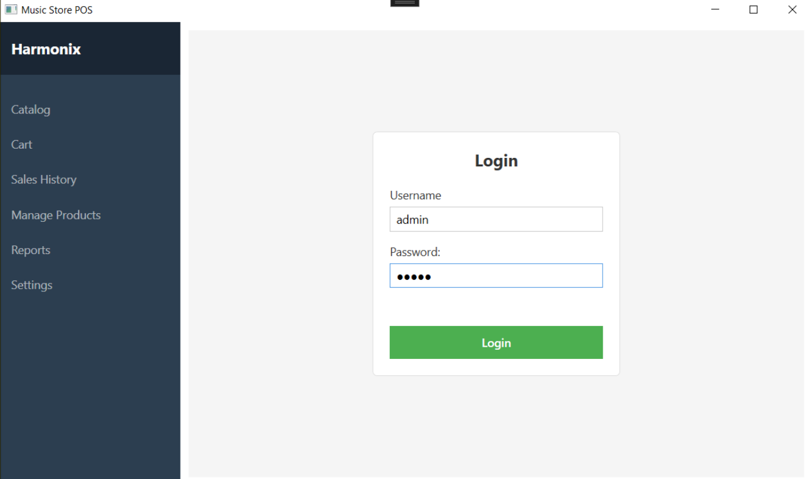
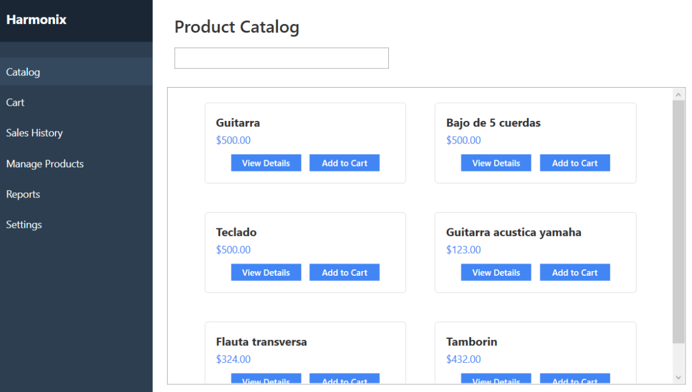
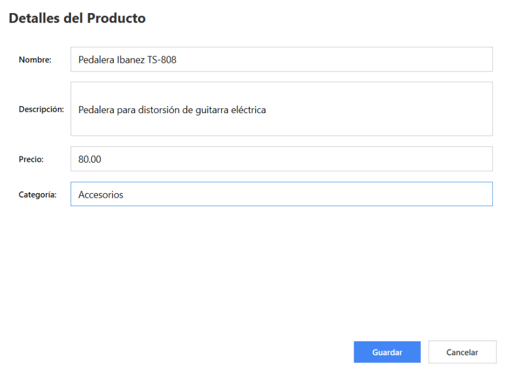
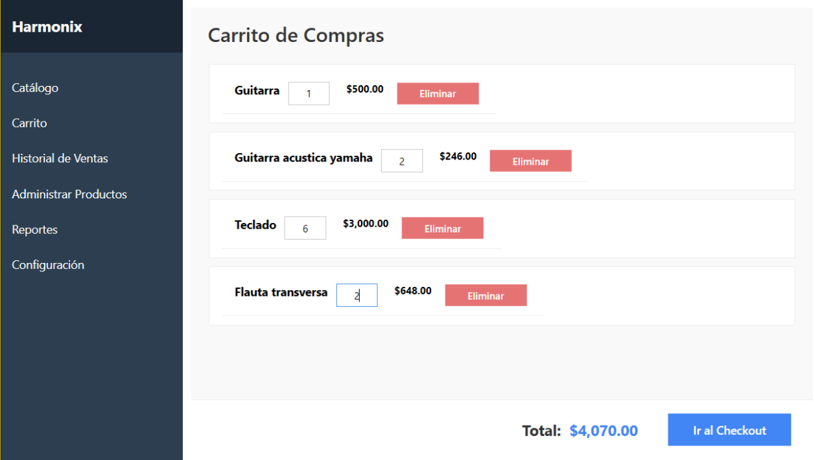
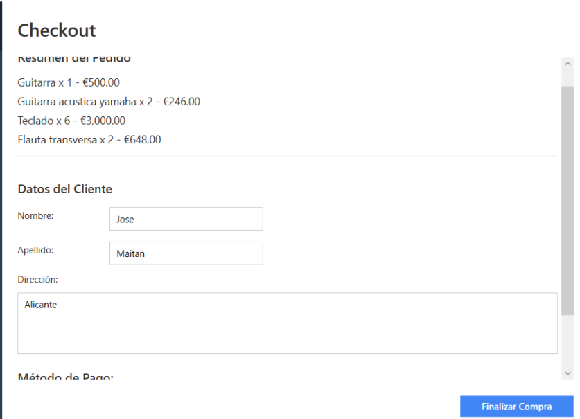
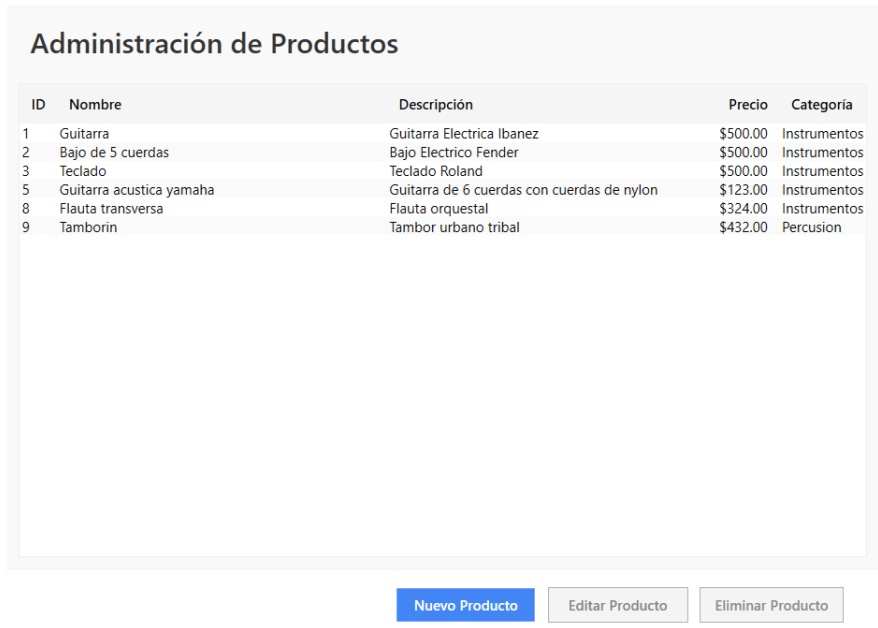
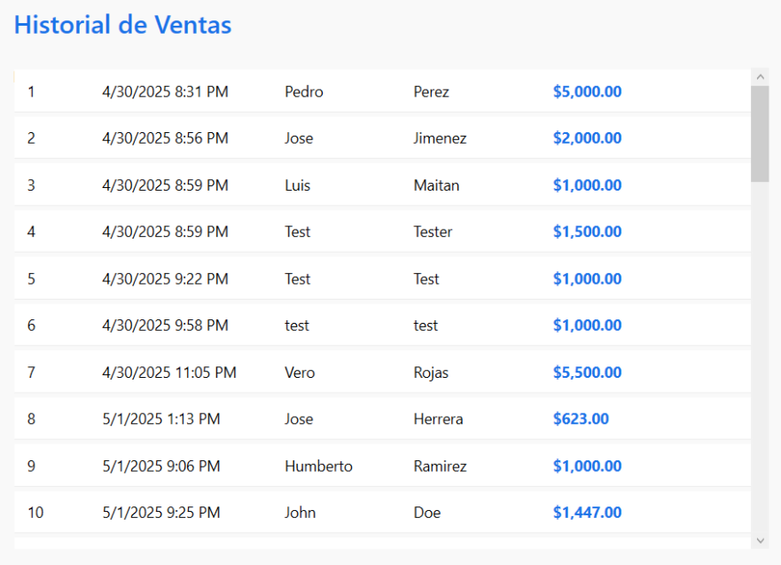
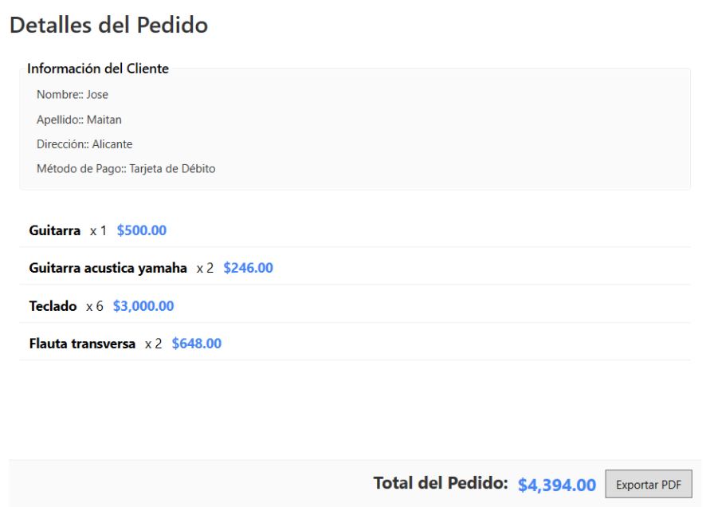
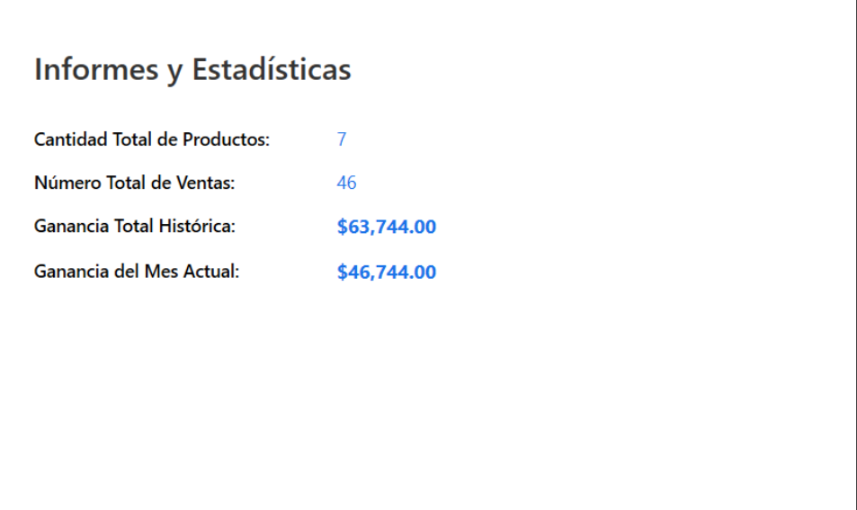
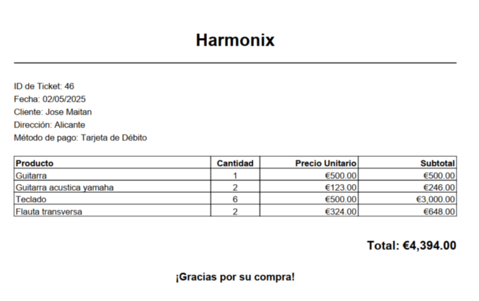

# WPF Music Store POS System 🎶

This project is a point-of-sale (POS) system designed for a music store, built using **.NET 8** and **WPF**. The system is architected to handle key business operations, including sales, product management, and reporting, all within a modern, user-friendly desktop application.

### Technical Stack & Architecture

The application is built on a clean and scalable architecture, leveraging a number of powerful .NET technologies:

* **Architecture**: The system strictly follows the **MVVM (Model-View-ViewModel)** design pattern, which ensures a clear separation of concerns. This approach enhances code maintainability, testability, and scalability.
* **Frontend**: The user interface is developed with **WPF**, utilizing **XAML** for a rich and declarative UI and **Data Binding** for a responsive user experience.
* **Backend**: The application logic is written in **C#** on **.NET 8**.
* **Data Layer**: **Entity Framework Core 8** is used with a Code-First approach to manage all database interactions. The data is persisted in **SQL Server**, a reliable relational database management system.
* **Third-Party Libraries**: The project integrates external libraries for key functionalities:
    * **iTextSharp** for dynamic generation of professional PDF invoices.
    * **Serilog** for robust and detailed logging of system events and transactions.

### Key Features

* **Secure Authentication**: Differentiates between two user roles (Administrator and Seller) with password hashing for security.
* **Product Catalog**: Features a dynamic product list with real-time search and the ability to add products to a shopping cart.
* **Sales & Checkout**: Manages the sales workflow from cart to payment, capturing essential customer data and confirming transactions.
* **Product Management (CRUD)**: Provides administrators with a complete module to create, read, update, and delete products, including extensive data validation.
* **Sales History**: Allows users to view a list of all past transactions, including detailed line-item information and the option to generate a PDF invoice.
* **Basic Reports**: Displays key business metrics, such as total earnings, by querying the database using **LINQ**.
* **Internationalization**: Supports a seamless switch between English and Spanish languages, with the user's preference being persisted.

---

### Future Improvements

Due to time constraints, some planned features were not fully implemented. This is a list of potential enhancements to the project:

* **Advanced Inventory Management**: Implement real-time stock tracking and low-inventory alerts.
* **Payment Gateway Integration**: Automate the payment process by integrating with an external electronic payment gateway.
* **Advanced Reporting**: Develop more detailed business analytics, including sales trends and top-performing products.
* **Code Refactoring**: Further optimize the codebase for readability, performance, and long-term maintainability.

---

### How to Run

1.  Clone this repository to your local machine.
2.  Open the project file (`.sln`) in Visual Studio.
3.  To create the database, run the Entity Framework migrations from the Package Manager Console in Visual Studio: `Update-Database`. Remember to change your user and password from your correspondign SQL Server database instance.
4.  Build and run the project.

---

### App Screenshots

#### Login Page

#### Catalog Page

#### Product Details Page

#### Cart Page

#### Checkout Page

#### CRUD Page

#### Sales History Page

#### Sale Details Page

#### Reports Page

#### Invoice PDF Example

